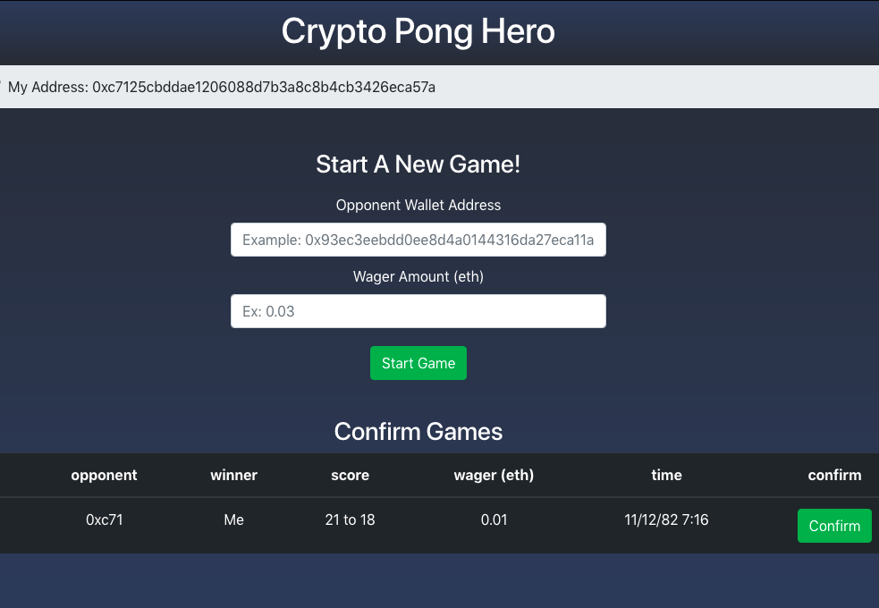

### Welcome to Crypto Pong Hero

[Crypto Pong Hero](http://crypto-pong-hero.surge.sh/) is first decentralized ping pong league on the ethereum blockchain

### Usage

+ For now, CPH requires a web3 enabled browser.  This can be accomplished by using the [metamask](https://metamask.io/) extension for Chrome or Firefox, or a Web3 enabled browser such as [brave](https://brave.com/).  Both are secure options that allow you to use your ethereum wallet to record your scores and ranking.
+ Once you've installed metamask, create a new wallet (dont forget to write down you seed phrase!) and select the Ropsten Test Network instead of the Main Ethereum Network.  (future release will see CPH on the main network)
+ With your address made and the Ropsten Network selected, you're ready to play!  Just enter an opponent's wallet address, and optional wager, and press Start Game!
+ You can view your profile and position on the global leaderboard from the nav bar.

### Technologies

Crypto Pong Hero was built from the ground up using React.js, solidity, Web3.js, and HTML5/CSS3.  

### Solidity

If you would like to view the actual smart contract on the Robsten Test Network, a link to that repo is [here](https://github.com/N-Will-Lee/crypto-pong-hero-contract).

### License

MIT